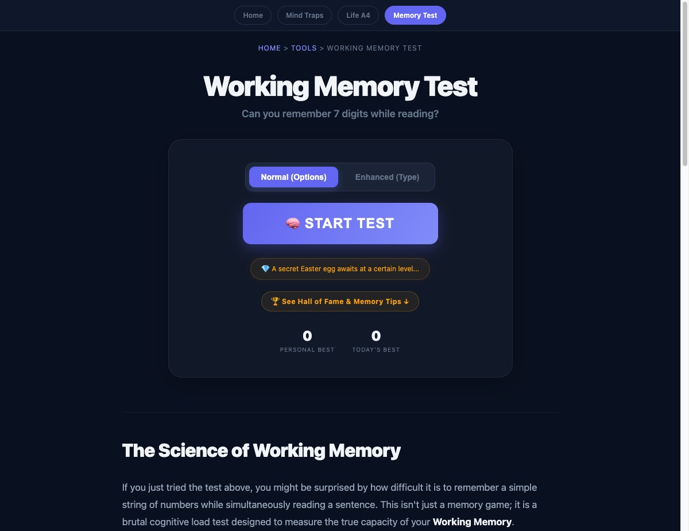

# Working Memory Test

**Can you remember 7 digits while reading a quote?**

A brutal dual-task cognitive challenge benchmarked against WAIS-IV norms. Free, open source, no signup.

🧠 **[Play it live →](https://ordinarymantrying.com/tools/digit-memory-test/)**



---

## How it works

1. A string of digits appears on screen
2. A famous quote appears simultaneously — you must read it
3. After the quote disappears, type back the digits from memory
4. Each round, the digit string grows by one
5. Miss once — game over

The dual task (reading + memorizing) simulates real working memory load, not just rote repetition.

---

## Why this measures something real

Standard digit span tests (like the WAIS-IV subtest) measure working memory capacity in isolation. This version adds a **distractor task** — reading a quote — forcing genuine cognitive resource allocation.

| Score | Benchmark |
|-------|-----------|
| 4–5 digits | Below average |
| 5–7 digits | Average (Miller's Law: "7 ± 2") |
| 7–9 digits | Above average |
| 9+ digits | Extremely rare |

Research reference: [Miller, G.A. (1956). "The Magical Number Seven, Plus or Minus Two"](https://en.wikipedia.org/wiki/The_Magical_Number_Seven,_Plus_or_Minus_Two)

---

## Features

- **Dual task design** — digits + reading quote simultaneously
- **Adaptive difficulty** — digit length grows each round
- **WAIS-IV benchmarking** — instant feedback on where you stand
- **Hall of Fame** — global leaderboard for top scores
- **No login, no ads** — 100% free
- **Single HTML file** — zero dependencies, works offline

---

## Run locally

```bash
git clone https://github.com/daligao/working-memory-test
cd working-memory-test
open index.html   # or just double-click
```

No build step. No npm install. Pure HTML/CSS/JS.

> Note: The Hall of Fame leaderboard requires a server with PHP. For local use, it simply won't submit scores — the core game works fully offline.

---

## Related

- [Mind Traps Quiz](https://github.com/daligao/psychology-laws-awesome) — Test if you *apply* cognitive biases in real decisions, not just recognize them

---

## License

MIT — use it, fork it, build on it.
